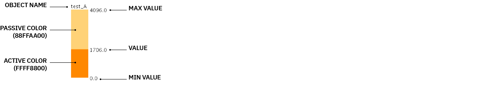

# Quick Visualizer for Processing 3
This processing sketch was developed to quickly visualize sensor data or other values sent to the computer over a serial port. The sketch provides three types of visualizations: 
1. _Clickers_ for binary events (e.g. on/off).
2. _Sliders_ for continuous values.
3. _Graphers_ for values over time in the form of a line chart.

Each type of object can be edited through its CSV file, found in the sketch's data folder. Each row in CSV file creates a new object. While parameters for each object are defined in the CSV's headers and can be edited.

**To Use, download the entire "quick_vis" folder from this repository.**
  

## Formatting Serial Communication
The sketch listens to incoming messages from a serial port. For it to work, the incoming serial message must be formatted as such:

- Separate values are separated by a space character: `' '`
- The message ends with a line break character: `'\n'`

Each value has an index based on its order in the message:
 
0&nbsp;&nbsp;&nbsp;&nbsp;&nbsp;&nbsp;1&nbsp;&nbsp;&nbsp;&nbsp;&nbsp;&nbsp;2&nbsp;&nbsp;&nbsp;&nbsp;&nbsp;&nbsp;--> serial index
 
`105 202 350`&nbsp;&nbsp;--> example message

_PRO TIP:_ Serial port selection is automatic. Processing selects the first serial port that returns the line break `'\n'` character.
  

## Clickers

| Parameter | Type | Description |
| --- | --- | --- |
| NAME | `String` | Name of visualization object |
| SERIAL_INDEX | `Integer` | Index of value in serial message that updates this object |
| TRIGGER_VAL | `Float` | Threshold value between active and passive states |
| INVERTED | `TRUE / FALSE` | If `TRUE`, object is active when value is below `TRIGGER_VAL`. If `FALSE`, object is active when value is above `TRIGGER_VAL`. |
| TOGGLE | `TRUE / FALSE` | If `TRUE`, object switches state when value crosses `TRIGGER_VAL` in one direction and stays in that state till the next time the value crosses `TRIGGER_VAL` in the same direction. |
| POS_X | `Float` | x position of object (number of pixels from left edge of screen to left edge of object). |
| POS_Y | `Float` | y position of object (number of pixels from top edge of screen to top edge of object). |
| WIDTH | `Float` | width of object |
| HEIGHT | `Float` | height of object |
| COLOR_PASSIVE | `Hex String` | Fill of the object when passive e.g. `FF2266AA` First 2 characters indicate the alpha (transparency) value. Where `00` is completely transparent and `FF` is completely opaque. Subsequent pairs indicate red, green, and blue values. _Tip: for complete transparency, use `00FFFFFF`_ [More Info](https://processing.org/reference/color_datatype.html) |
| COLOR_ACTIVE | `Hex String` | Fill of the object when active e.g. `FF2266AA` First 2 characters indicate the alpha (transparency) value. Where `00` is completely transparent and `FF` is completely opaque. Subsequent pairs indicate red, green, and blue values. _Tip: for complete transparency, use `00FFFFFF`_ [More Info](https://processing.org/reference/color_datatype.html) |
| IMG_PASSIVE | `String` | Optional file name (with extension) of an image. Displays an image over the object when passive. Images should be loaded in the `data` folder. |
| IMG_ACTIVE | `String` | Optional file name (with extension) of an image. Displays an image over the object when active. Images should be loaded in the `data` folder. |
| SHOW_NAME | `TRUE / FALSE` | Determines if object's name should be displayed. |
| SHOW_VAL | `TRUE / FALSE` | Determines if object's value (from serial) should be displayed. |

  

## Sliders

| Parameter | Type | Description |
| --- | --- | --- |
| NAME | `String` | Name of visualization object |
| SERIAL_INDEX | `Integer` | Index of value in serial message that updates this object |
| MIN | `Float` | Minimum value of the slider's range. |
| MAX | `Float` | Maximum value of the slider's range. |
| INVERTED | `TRUE / FALSE` | If `TRUE`, slider extends from `MAX` to `MIN`. If `FALSE`, slider extends from `MIN` to `MAX`. |
| DIRECTION | `HORIZONTAL / VERTICAL` | Slider's extension direction. |
| POS_X | `Float` | x position of object (number of pixels from left edge of screen to left edge of object). |
| POS_Y | `Float` | y position of object (number of pixels from top edge of screen to top edge of object). |
| WIDTH | `Float` | width of object |
| HEIGHT | `Float` | height of object |
| COLOR_PASSIVE | `Hex String` | Fill of the slider's background e.g. `FF2266AA` First 2 characters indicate the alpha (transparency) value. Where `00` is completely transparent and `FF` is completely opaque. Subsequent pairs indicate red, green, and blue values. _Tip: for complete transparency, use `00FFFFFF`_ [More Info](https://processing.org/reference/color_datatype.html) |
| COLOR_ACTIVE | `Hex String` | Fill of the slider's extension e.g. `FF2266AA` First 2 characters indicate the alpha (transparency) value. Where `00` is completely transparent and `FF` is completely opaque. Subsequent pairs indicate red, green, and blue values. _Tip: for complete transparency, use `00FFFFFF`_ [More Info](https://processing.org/reference/color_datatype.html) |
| SHOW_NAME | `TRUE / FALSE` | Determines if object's name should be displayed. |
| SHOW_VAL | `TRUE / FALSE` | Determines if object's value (from serial) should be displayed. |

  

## Graphers

| Parameter | Type | Description |
| --- | --- | --- |
| NAME | `String` | Name of visualization object |
| SERIAL_INDEX | `Integer` | Index of value in serial message that updates this object |
| MIN | `Float` | Minimum value of the chart's range. |
| MAX | `Float` | Maximum value of the chart's range. |
| HISTORY | `Integer` | Number of previous values to keep track of. |
| POS_X | `Float` | x position of object (number of pixels from left edge of screen to left edge of object). |
| POS_Y | `Float` | y position of object (number of pixels from top edge of screen to top edge of object). |
| WIDTH | `Float` | width of object |
| HEIGHT | `Float` | height of object |
| COLOR_PASSIVE | `Hex String` | Fill of the chart's background e.g. `FF2266AA` First 2 characters indicate the alpha (transparency) value. Where `00` is completely transparent and `FF` is completely opaque. Subsequent pairs indicate red, green, and blue values. _Tip: for complete transparency, use `00FFFFFF`_ [More Info](https://processing.org/reference/color_datatype.html) |
| COLOR_ACTIVE | `Hex String` | Fill of the chart's line e.g. `FF2266AA` First 2 characters indicate the alpha (transparency) value. Where `00` is completely transparent and `FF` is completely opaque. Subsequent pairs indicate red, green, and blue values. _Tip: for complete transparency, use `00FFFFFF`_ [More Info](https://processing.org/reference/color_datatype.html) |
| LINE_WEIGHT | `Float` | Chart's line weight. |
| SHOW_NAME | `TRUE / FALSE` | Determines if object's name should be displayed. |
| SHOW_VAL | `TRUE / FALSE` | Determines if object's value (from serial) should be displayed. |

  

## Additional Tips

This sketch simply visualizes incoming values from the serial connection. All computation / manipulation of the values should be done before sending it over serial. e.g. Averaging two sensor readings.

Objects can be positioned on top of each other by introducing transparency in their passive and active colors.
